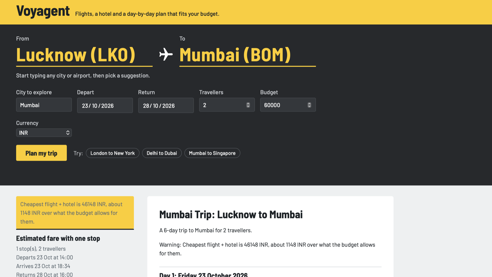
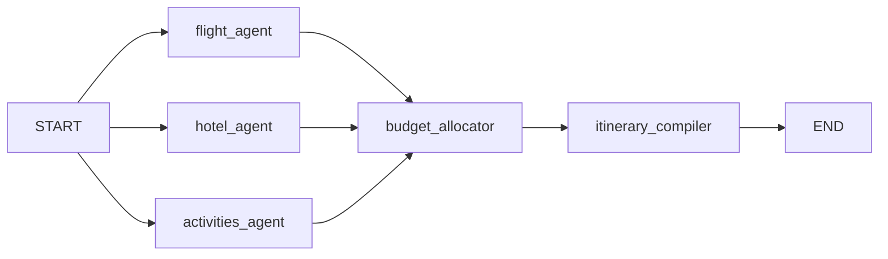

# Voyagent

A multi-agent trip planner. Give it two cities, dates, travellers and a budget, and it
searches flights, hotels and things to do, works out what fits the money, and writes a
day-by-day plan grounded in what it actually found.

**Live demo:** https://voyagent-ecdu.onrender.com



## What it does

- Takes any city or airport by name ("Lucknow", "Port Blair", "LKO"), worldwide
- Searches round-trip flights for the number of travellers you enter
- Finds real hotels in the destination, at both normal and budget price points
- Picks the best-rated flight and hotel pair that fits the budget, then fills the rest
  with things to do
- Converts every price into your currency using live exchange rates
- Writes the itinerary with an LLM that may only use the options already chosen
- Says clearly when a trip is over budget, and by how much, instead of quietly
  downgrading it

## How it works

Five agents on a LangGraph state machine. The three search agents run in parallel, the
budget allocator waits for all of them, and the compiler writes the plan last.



| Agent | Job | Source |
|---|---|---|
| `flight_agent` | Round-trip search for N passengers | Duffel API, distance model as fallback |
| `hotel_agent` | Real hotels, two price bands | Google Places (New) |
| `activities_agent` | Top-rated things to do | Google Places (New) |
| `budget_allocator` | Choose what fits the money | Plain Python, no LLM |
| `itinerary_compiler` | Write the day-by-day plan | Gemini, Claude optional |

### Why the allocator has no LLM

Choosing a flight and hotel under a budget is a constraint problem, not a language
problem. It runs as plain Python: convert every price to the trip currency, hold back
15% for food and transport, reserve a floor for activities, score each flight and hotel
pair on rating minus a penalty per stop, and take the best pair that fits. The result is
deterministic, free, instant and unit-tested.

### Keeping the LLM honest

The compiler only sees the selected flight, hotel and activities, plus pre-computed dates
and weekdays. The prompt forbids inventing venues, bookings or prices, and requires every
figure to be copied exactly. If every model is rate-limited or down, a plain-Python
fallback still produces a usable day-by-day plan.

### Failing softly

Each search agent is wrapped so a crash returns an empty result instead of killing the
request. A Places outage means a trip without activities, not an error page. An unknown
route falls back to an estimated fare rather than "no flights found".

## What's real and what's estimated

Being straight about this matters more than looking impressive.

| Part | Status |
|---|---|
| Hotel names, ratings, addresses | Real, from Google Places |
| Things to do | Real, from Google Places |
| Exchange rates | Real, ECB rates via Frankfurter |
| Flight prices | Real on the routes Duffel's test environment covers |
| Flight prices elsewhere | Estimated from great-circle distance, marked as an estimate |
| Hotel prices | Estimated from Google's price level or rating |
| Activity prices | Estimated; no free API publishes ticket prices |

Nothing here can be booked. Duffel runs in test mode.

## Running it yourself

```bash
git clone https://github.com/Parth160905/Voyagent.git
cd Voyagent
python -m venv venv && source venv/bin/activate
pip install -r requirements.txt
```

Create a `.env` file:

```
DUFFEL_API_KEY=duffel_test_...
GOOGLE_PLACES_API_KEY=...          # Places API (New) must be enabled
GEMINI_API_KEY=...                 # free tier is enough
# optional
LLM_PROVIDER=gemini                # or "claude", with ANTHROPIC_API_KEY set
ENABLE_TEST_ROUTES=1               # exposes the per-agent /test-... routes locally
```

```bash
uvicorn main:app --reload
```

Then open http://127.0.0.1:8000.

## Layout

```
agents/          the five agents
api_clients/     Duffel, Google Places, exchange rates, airport lookup, fare model
schemas/         the shared TripState
web/             the planner page and its JSON API
graph.py         how the agents are wired together
main.py          FastAPI app
```

## Protecting the public demo

The live instance calls APIs with quotas, so `/api/plan` limits each visitor to 5 plans
an hour and the whole service to 100 a day, validates dates and trip length, caches
identical requests for 15 minutes, and hides the per-agent test routes unless
`ENABLE_TEST_ROUTES` is set.

## Next

- A paid flights feed for real fares on every route
- A hotel rates API instead of price-level estimates
- Streaming the itinerary as it is written, so the wait feels shorter
